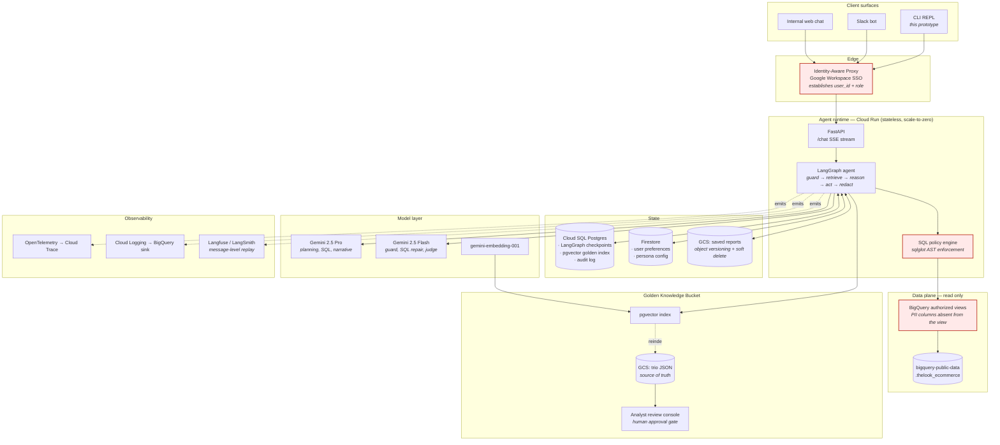
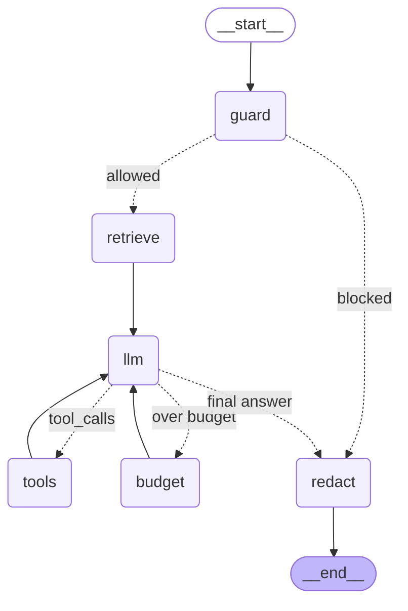
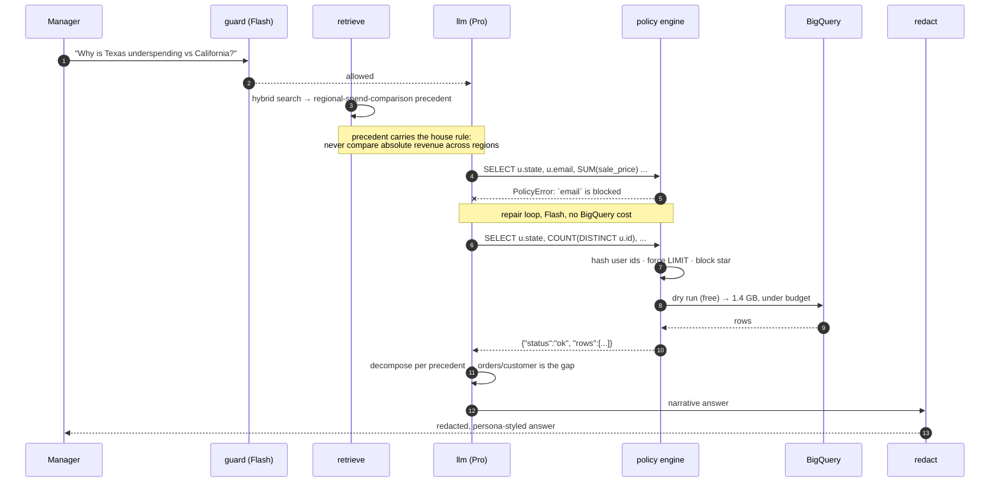
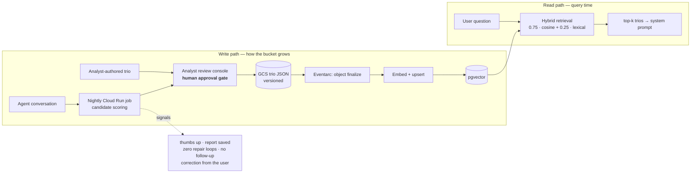

# High-Level Design — Retail Analytics Chat Assistant

## 1. System context (production target)

Red-bordered blocks are the deterministic safety boundary. Nothing in that boundary depends on
model behaviour — the model can be fully compromised by prompt injection and still cannot reach PII.

## 2. Agent graph

The compiled LangGraph (exported directly from the running prototype):

| Node | Responsibility | Model |
|---|---|---|
| `guard` | Scope + prompt-injection screen. Fails **open** — see §3. | Flash, structured output |
| `retrieve` | Hybrid search of the Golden Bucket for the current question | Embedding + lexical |
| `llm` | Plan, choose tools, write SQL, narrate the answer | Pro |
| `tools` | `describe_data`, `search_precedents`, `query_data`, `save_report`, `remember_preference` | — |
| `budget` | Hard stop. Answers pending tool calls, unbinds tools, forces a final answer | — |
| `redact` | Output scrub + drops dangling tool calls so history stays valid | — |

**Termination is deterministic.** `redact` is the only edge to `END`, and once `exhausted` is set the
router can only reach `redact`. A misbehaving model cannot loop the graph, so the recursion limit is
never the thing that stops us — a bounded budget is.

## 3. The request path for one question

## 4. Golden Bucket lifecycle

A trio never enters the bucket without human approval. An unreviewed write-back loop is how a
knowledge base poisons itself: one confidently wrong report becomes the precedent that teaches the
next ten answers to be wrong the same way.

## 5. Component choices and why

| Concern | Choice | Reasoning |
|---|---|---|
| Agent framework | **LangGraph** | The requirements are all control-flow requirements: a confirmation interrupt for deletes, a bounded repair loop, a guard that must run before anything else, resumable multi-turn state. LangGraph makes the control flow an explicit, inspectable, testable graph and ships durable checkpointing and `interrupt()` as primitives. A ReAct-only framework (plain LangChain agent, CrewAI) hides exactly the part we must be able to prove correct. |
| Compute | **Cloud Run** | Bursty, request-scoped, long-tailed (a multi-step analysis can take minutes). Cloud Run gives 60-minute request timeouts, per-instance concurrency, scale-to-zero between the exec team's working hours, and no cluster to operate. GKE buys nothing here. |
| Reasoning model | **Gemini 2.5 Pro** | Long context for schema + precedents + history, strong text-to-SQL, native structured output and tool use. |
| Utility model | **Gemini 2.5 Flash** | The guard, the SQL repair and the eval judge run on every turn and must not dominate cost or latency. Roughly an order of magnitude cheaper; the tasks are narrow and well-specified. |
| Conversation state | **Postgres checkpointer** (SQLite in the prototype) | LangGraph's `AsyncPostgresSaver` on Cloud SQL. Transactional, survives instance recycling, and the checkpoint tables double as an audit record of what the agent saw. |
| Preferences / persona | **Firestore** | Single-document reads keyed by user, sub-10 ms, trivially editable by an internal admin page. Relational modelling buys nothing for a preference blob. |
| Golden index | **pgvector on the existing Cloud SQL** | At the realistic scale of this bucket (thousands, not millions, of trios) a dedicated vector service is operational overhead for no gain. pgvector keeps vectors transactional with their metadata and lets hybrid search be one SQL statement. Move to Vertex AI Vector Search only past ~1M vectors. |
| Data access | **BigQuery authorized views + policy tags** | PII must be unreachable, not merely unrequested. The service account can read a view in which the sensitive columns do not exist. |
| Reports | **GCS with object versioning** | Soft delete and restore come free from the storage layer, which is what a "delete" of an executive's report should mean. |
| Tracing | **OpenTelemetry + Langfuse** | OTel for infrastructure spans, Langfuse for prompt/response/tool-call replay, joined on `trace_id`. |

## 6. Prototype scope vs production

| | Prototype (this repo) | Production |
|---|---|---|
| Interface | CLI REPL | Cloud Run + FastAPI, Slack, web |
| Checkpoints | SQLite file | Cloud SQL Postgres |
| Golden index | numpy in-process, cached to `.npz` | pgvector, Eventarc reindex |
| Preferences | `data/preferences.json` | Firestore |
| PII defence | sqlglot AST policy + output scrub | the same, **plus** authorized views and policy tags |
| Persona | `data/persona.md`, re-read every turn | GCS object + admin page, 60 s TTL |
| Reports | local JSON | GCS, versioned, soft delete |
| Traces | JSONL in `logs/` | Cloud Logging → BigQuery, Langfuse |
