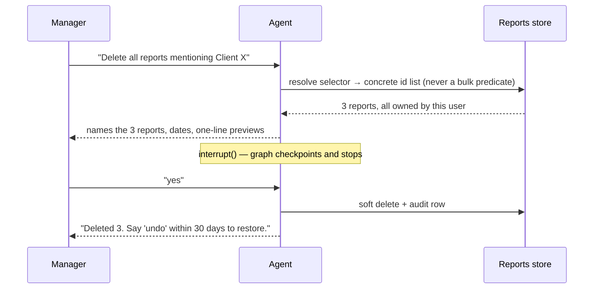

# Technical Explanation

Read alongside [architecture.md](architecture.md). Each section states what is **built** in this
repo and what is **designed** for production. Code references are clickable.

---

## 1. Hybrid Intelligence — the Golden Bucket

**Built.** Six analyst trios in [`data/knowledge_base/`](../data/knowledge_base), retrieved by
[`src/tools/golden.py`](../src/tools/golden.py) and injected into the system prompt by
[`src/prompts/system_prompts.py`](../src/prompts/system_prompts.py).

### What a trio actually carries

The SQL is the least valuable third. The valuable part is the analyst's *interpretation* and the
house conventions embedded in it. From `04_regional_underspend.json`:

> Decompose revenue into customers × orders per customer × average item value and identify which of
> the three terms actually moved. **Never compare absolute revenue across regions of different
> size.**

That rule is not derivable from the schema and not something a model reliably invents. Without it,
"why is Texas underspending vs California" gets answered with a raw revenue gap that is really a
population difference — technically correct SQL, useless analysis. Each trio therefore ends with an
explicit **Convention** block, and the retrieved trios go into the system prompt under a heading the
model is instructed to treat as binding.

### Retrieval at query time

Hybrid, in [`golden.py:search`](../src/tools/golden.py):

```
score = 0.75 · cosine(embedding(question), embedding(trio)) + 0.25 · lexical_overlap
```

The embedded document is question + tags + report, not the SQL — managers phrase questions in
business language, and matching against the analyst's prose is what surfaces the right precedent.
The lexical term is what rescues exact-token queries ("returns", "churn", a brand name) that
embeddings smear. Vectors are cached to `.index.npz` keyed by a blake2b fingerprint of the corpus,
so a restart costs nothing and a trio edit invalidates automatically.

**If the embedding API is down, retrieval degrades to pure lexical rather than failing** — the agent
still gets precedents, just ranked less well.

### Updating the bucket over time

```
conversation → nightly scoring job → analyst review console → GCS → Eventarc → embed → pgvector
```

Candidate signals: the user gave a thumbs-up, the report was saved or shared, the SQL needed zero
repair attempts, and no correction ("no, I meant…") followed in the thread. High-scoring
conversations are queued for an analyst who edits the interpretation and approves.

**The human gate is not optional.** An auto-promoting loop is how the bucket poisons itself: one
confidently wrong report becomes the precedent that teaches the next ten answers the same error, and
retrieval means the error spreads to *similar* questions rather than staying contained. The write
path is deliberately slow; the read path is fast.

---

## 2. Safety & PII Masking — **built**

Four independent layers. Three of them are deterministic code, so **a fully prompt-injected model
still cannot emit PII**.

### Layer 1 — Intent guard (model, fails open)

[`agent.py:_guard`](../src/agent/agent.py) runs Flash with structured output before anything else.
It blocks instruction-override attempts, requests for identifiable customer data, and off-topic use.

It deliberately **fails open** on API error. The guard defends scope, not PII — PII is defended by
layers 2–4, which cannot fail open because they are not models. Failing closed would turn a
transient Flash blip into a total outage for a well-behaved manager, in exchange for no real
security. That trade is only sound *because* the deterministic layers exist below it.

### Layer 2 — SQL policy engine (deterministic)

[`src/utils/pii.py:enforce`](../src/utils/pii.py) parses every query into a sqlglot AST — string
matching on SQL is not a control, it is a speed bump — and enforces:

| Control | Rejects |
|---|---|
| Statement type | anything that is not a single `SELECT`/`WITH` — no DML, DDL, multi-statement |
| Table allowlist | anything outside the four approved tables, including `INFORMATION_SCHEMA` |
| Column blocklist | `email`, `first_name`, `last_name`, `street_address`, `postal_code`, `latitude`, `longitude`, `user_geom` — **anywhere** in the tree, including inside a CTE that aliases them away |
| Star projection | `SELECT *` and `t.*` (which would smuggle blocked columns past a name check). `COUNT(*)` is allowed |
| Row cap | injects or clamps `LIMIT 500` |

Customer identifiers are **rewritten, not blocked** — the AST is edited to wrap them in
`SUBSTR(TO_HEX(SHA256(CONCAT(salt, …))), 1, 12)`:

```sql
-- the model wrote                        -- what BigQuery receives
SELECT user_id, SUM(sale_price) AS spend  SELECT SUBSTR(TO_HEX(SHA256(CONCAT('…',
FROM order_items                                  CAST(user_id AS STRING)))), 1, 12) AS user_id,
GROUP BY 1                                       SUM(sale_price) AS spend …
```

This is why "who are our top customers" still works: the manager gets stable pseudonyms they can
track across queries and hand to CRM for resolution, and the agent never sees a real identity.
Rewriting only touches **output projections** — join keys inside CTEs stay raw, so joins still work.
An identifier that appears in a non-aggregate expression (`CAST(user_id AS STRING)`) is rejected
rather than silently passed, closing the obvious bypass; `COUNT(DISTINCT user_id)` is allowed
because an aggregate reveals nothing about an individual.

Unqualified `id` resolves to `users` whenever `users` is in scope — deliberately over-masking, since
over-hashing a product id is a cosmetic bug and under-hashing a customer id is a breach.

### Layer 3 — Output scrub (deterministic)

[`pii.py:scrub`](../src/utils/pii.py) runs on every tool result and on the final answer
([`agent.py:_redact`](../src/agent/agent.py)) — emails, phone numbers, card patterns, IPs. Tuned to
leave financial figures and ISO dates intact; `1,234,567.89` and `2023-01-01` survive, which naive
digit-run regexes destroy.

### Layer 4 — BigQuery authorized views (production)

The service account is granted `bigquery.dataViewer` on a view layer **from which the PII columns
are absent**, with Data Catalog policy tags on the underlying columns as defence in depth. At this
layer a leak is not blocked, it is impossible: there is no query the agent can construct that
returns an email, because the identity it runs as cannot see the column.

### Verification

[`tests/test_pii.py`](../tests/test_pii.py) — 16 tests including the CTE-aliasing bypass, `t.*`
smuggling, cross-project table access, multi-statement injection, and the `CAST` bypass.

---

## 3. High-Stakes Oversight — **designed**

Not coded (the two prototype requirements chosen were §2 and §5); the design is specific.



**Resolve, then confirm, then act.** The natural-language selector is turned into an explicit list of
report ids in a read-only step. Confirmation is on that list, shown by title — never on the phrase.
`"delete all the reports we made in this conversation"` resolves against the thread's checkpoint
history, so it is exact rather than a fuzzy match.

**Mechanism.** LangGraph's `interrupt()` in the delete node. The graph checkpoints and returns
control; the resume carries the user's decision. Because state is durable, the confirmation survives
an instance restart — the pending action is not held in memory.

**Authorisation is code, not prompt.** The ownership filter (`report.user_id == caller`) lives in the
tool, so "delete Manager B's reports" returns zero resolved ids regardless of what the model was
talked into. Deletes are soft with a 30-day tombstone on a versioned GCS bucket, every action writes
an audit row, and `undo` is a first-class command.

**UX.** Only destructive actions confirm; saving, reading and listing never do. One confirmation
covers a batch. The preview is the point — a manager approves *"these three, from March"*, not
*"a delete operation"*.

---

## 4. Continuous Improvement

### 4.1 User level — **built**

[`src/agent/memory.py`](../src/agent/memory.py) + the `remember_preference` tool. Preferences are a
per-user document, re-read and injected into the system prompt **on every turn**, so a preference
stated mid-conversation applies to the next answer.

Seeded in [`data/preferences.json`](../data/preferences.json):

```json
"manager_a": {"format": "always a markdown table when comparing numbers", "depth": "headline plus three supporting bullets"},
"manager_b": {"format": "short bullet points, never tables",              "depth": "wants the reasoning and the caveats spelled out"}
```

Try it: `/user manager_a` then `/user manager_b`, same question. Preferences are *stated* (the user
says "always give me tables") rather than inferred from behaviour — inferred preferences are
unpredictable and impossible for a user to correct. In production the nightly job proposes
candidates ("Manager A has asked for a chart in 4 of 5 sessions") and the agent asks once before
storing.

### 4.2 System level — **designed**

Three loops, in increasing order of risk and decreasing order of automation:

| Loop | Signal | Change | Gate |
|---|---|---|---|
| Golden Bucket growth | thumbs-up, saved reports, zero-repair SQL | new trios | analyst review |
| Prompt / persona tuning | eval-suite regressions, repair-rate spikes | system prompt, persona | eval suite in CI |
| Failure mining | recurring `sql_rejected` reasons in the trace sink | new policy hints, schema notes, new trios | engineer |

Failure mining is the highest-value and lowest-risk of the three: the JSONL trace already records
every rejection reason, so `GROUP BY error` over a week's traces names the top-10 things the agent
consistently gets wrong. Most resolve to one sentence in the prompt or one new trio.

No unattended weight updates and no unattended prompt edits. Every automated proposal lands in a
human queue.

---

## 5. Resilience & Graceful Error Handling — **built**

### The repair loop

[`src/agent/executor.py:run_sql`](../src/agent/executor.py):

```
enforce (AST policy)  ──fail──┐
dry_run (BigQuery, free) ─────┤→  Flash repair with the exact error  →  retry (max 3)
execute (capped) ─────────────┘                                       →  give up, tell the truth
```

**Repair is nearly free, by construction.** Validation happens against the sqlglot AST and a
BigQuery **dry run**, which returns the real parser and schema errors and is billed at zero bytes.
Repair itself runs on Flash. A query is only executed once it is known to be valid, so the expensive
resource is touched once, not four times. This is what satisfies "self-correct without inflating
costs" — the retries are on the free path.

Policy violations feed the *same* loop: the model that selects `email` gets told exactly which rule
it broke and rewrites the query using permitted columns. Safety and resilience share one mechanism.

### Empty results are not errors

An empty result returns `status: "empty"` with explicit guidance not to re-run unchanged. Retrying
identical SQL cannot change an empty result — the fix is semantic (wrong filter value, wrong date
range), so the reasoning model handles it with a small probing query. Blindly repairing here is pure
cost with zero chance of success.

### Bounded everything

| Bound | Value | Failure mode it prevents |
|---|---|---|
| `MAX_SQL_REPAIRS` | 3 | infinite repair spend |
| `MAX_STEPS` | 12 | runaway tool loop |
| `MAX_BYTES_BILLED` | 2 GB | a `CROSS JOIN` costing real money |
| `ROW_LIMIT` | 500 | context blowout, bulk exfiltration |
| `query_timeout_s` | 120 | a hung request holding an instance |

The step budget is enforced *deterministically*: [`agent.py:_route`](../src/agent/agent.py) can only
reach `redact` once `exhausted` is set, so a model that keeps emitting tool calls after tools are
unbound still terminates. This was a real bug caught by
[`test_step_budget_forces_termination`](../tests/test_agent.py) — the first implementation relied on
the model respecting unbound tools and looped to the recursion limit.

### Third-party failure

| Failure | Behaviour |
|---|---|
| BigQuery 5xx / rate limit | `google.api_core.Retry`, exponential backoff to 45 s |
| BigQuery down | `QueryError` → the agent reports it in plain language, UI intact |
| Gemini down (main) | caught in `_llm` → "I could not reach the analysis model just now"; conversation state is preserved, the user just re-asks |
| Gemini down (guard) | fails open; deterministic PII layers still hold |
| Gemini down (repair) | loop exits immediately rather than burning its budget on a dead service |
| Embeddings down | hybrid retrieval degrades to lexical |
| Any tool raising | `ToolNode(handle_tool_errors=True)` returns the error as an observation for the model to reason about |
| Misconfiguration | caught by `preflight()` at startup with an actionable message, before the REPL opens |

**The CLI never shows a traceback.** Verified by
[`test_llm_outage_degrades_without_crashing`](../tests/test_agent.py).

---

## 6. Quality Assurance — **designed**

### Before deployment — offline suite in CI

| Layer | Method | Gate |
|---|---|---|
| Policy | 16 unit tests incl. known bypasses | 100%, blocking |
| Red team | ~50 injection / PII-extraction prompts | **zero leaks**, blocking |
| SQL executability | eval questions must produce runnable SQL | ≥ 98% |
| SQL correctness | result-set equivalence vs analyst reference SQL (set comparison, not string) | ≥ 90% |
| Groundedness | Flash judge: every number in the report must appear in a tool result | ≥ 95%, blocking |
| Convention adherence | judge scores the answer against the retrieved trio's Convention block | ≥ 85% |
| Cost / latency | p95 tokens and seconds per question | regression alert |

### Does the report answer the user's *intent*?

Executability and groundedness do not catch the real failure — a correct answer to the wrong
question. Three checks:

1. **Intent restatement.** The judge is given the question and the report and must state what
   question the report actually answers. A human reviews the diffs. This surfaces silent scope
   drift ("last month" answered as "last 30 days") that no numeric check finds.
2. **Claim decomposition.** Each claim is extracted and traced to a tool result. Unsupported claim
   rate is the headline quality metric.
3. **Ambiguity handling.** A held-out set of deliberately ambiguous questions where the *correct*
   behaviour is to ask a clarifying question. Confidently answering an ambiguous question is a
   failure, and it is the failure mode LLM judges are most likely to reward.

### UX evaluation

Offline proxies do not measure UX. In production:

- **Thumbs up/down** with an optional reason — the only direct signal, so make it one keystroke.
- **Correction rate** — turns where the next message is a correction ("no, I meant"). The strongest
  automatic signal that an answer missed.
- **Follow-up depth** — a healthy discussion is 3–5 turns. One turn then abandonment means the first
  answer failed; fifteen turns means the agent is not converging.
- **Report save rate** — did the output justify keeping.
- **Time to first answer**, p50 and p95. Managers abandon past ~30 s with no output, which is why
  the interface streams tool activity rather than blocking on a spinner.
- **Quarterly moderated sessions** with 5–6 managers. Small-n qualitative work catches what metrics
  cannot: the answer was right and they did not trust it.

---

## 7. Observability — **partly built**

[`src/utils/logger.py`](../src/utils/logger.py) writes a structured JSONL event stream with a
`trace_id` per turn, surfaced in the CLI and replayable with `/trace`.

```json
{"ts": 1757, "trace": "a1b2c3", "event": "sql_rejected", "attempt": 0, "kind": "PolicyError", "error": "Column `email` is …"}
{"ts": 1758, "trace": "a1b2c3", "event": "sql_repaired", "before": "SELECT u.email …", "after": "SELECT u.state …"}
{"ts": 1760, "trace": "a1b2c3", "event": "sql_ok", "seconds": 2.1, "repairs": 1, "gb_scanned": 1.4, "cache_hit": false, "rows": 12}
```

Instrumented today: `guard`, `guard_unavailable`, `golden_search`, `golden_lexical_fallback`,
`sql_rejected`, `sql_repaired`, `sql_ok`, `sql_empty`, `sql_gave_up`, `repair_unavailable`,
`bq_execute`, `llm_unavailable`, `budget_exhausted`, `output_redacted`,
`dangling_tool_calls_dropped`, `preference_saved`.

### Metrics at the agent level

| Class | Metric | Why it earns a dashboard slot |
|---|---|---|
| **Correctness** | unsupported-claim rate | the failure that damages trust |
| | SQL repair rate, repairs per query | rising = schema drift or prompt rot |
| | give-up rate (`sql_gave_up`) | questions the agent cannot serve |
| | empty-result rate | usually a filter-value or date-range misunderstanding |
| **Safety** | policy rejections by rule | a spike on one rule = a new bypass being probed |
| | guard block rate + `guard_unavailable` | attack volume, and how long we ran fail-open |
| | **PII leak rate** | must be 0; anything else pages |
| **Cost** | tokens and $ per answered question | the number that decides whether this scales |
| | GB scanned per question, cache-hit rate | BigQuery is the cost floor |
| | budget-exhaustion rate | agent not converging |
| **Latency** | p50/p95 end-to-end, per node | isolates whether Pro, BigQuery or retrieval is slow |
| **Quality** | thumbs-up rate, correction rate, save rate | §6 |
| **Availability** | error rate by dependency | which third party is degrading |

### Deep-dive debugging

Every surface carries the same `trace_id`: CLI output, JSONL events, OTel spans, Langfuse traces,
and the BigQuery job labels. From a complaint, the path is: `trace_id` → full message correspondence
(system prompt including the retrieved trios and the persona version, every tool call and result,
every repair attempt with its error) → the exact BigQuery job with its bytes and duration.

The three questions this must answer without guesswork: *what did the model see* (which trios, which
persona version, which preferences), *what did it try* (every SQL attempt, not just the successful
one), *where did it go wrong* (which node, which dependency).

Alerting: PII leak > 0 (page), give-up rate > 5% over 1 h, p95 latency > 60 s, cost per question 2×
its 7-day baseline, guard unavailable > 5 min.

---

## 8. Agility (Persona Management) — **built**

[`data/persona.md`](../data/persona.md) is plain markdown, read **on every turn** by
[`system_prompts.build`](../src/prompts/system_prompts.py). Edit the file, send the next message,
the tone changes. No restart, no redeploy, no code.

It is deliberately separated from the operational instructions: `ROLE` holds the rules that keep the
agent correct and safe, `persona.md` holds only voice, tone, structure and length. The CEO can
rewrite the persona weekly without any possibility of disabling the PII policy or the query
discipline — the persona is not in a position to override anything that matters.

**Production.** The file becomes a GCS object edited through a small internal admin page with a
preview-before-publish step, versioning, and one-click rollback. Cached in-process for 60 s. Every
trace records the persona version, so "reports got worse this week" is answerable by diffing
persona versions against the quality metrics from §6.

---

## Data flow summary

| Data | At rest | In transit | Retention |
|---|---|---|---|
| Raw transactions | BigQuery, Google-managed encryption | never leaves BigQuery unaggregated | source-owned |
| PII columns | in BigQuery only | **never** — absent from views, blocked by the AST policy, hashed on output | n/a |
| Conversation state | Postgres checkpoints (SQLite in prototype) | TLS | 90 days |
| Preferences | Firestore (JSON in prototype) | TLS | until the user clears them |
| Saved reports | GCS, versioned (JSON in prototype) | TLS | soft delete + 30-day tombstone |
| Golden trios | GCS + pgvector | TLS | versioned indefinitely |
| Traces | Cloud Logging → BigQuery (JSONL in prototype) | TLS | 30 days hot, 400 days archived |

Query results reaching the model are already aggregated, row-capped and pseudonymised. The model
never receives a raw transaction log row.
